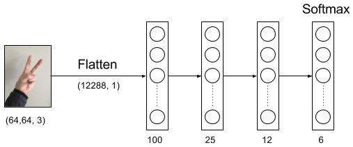

## Description

This project assembles an artificial neural network, that uses the TensorFlow framework to classify numbers from 0 to 5 using images of sign language.

For this project we use a substet from the SIGNS dataset:

* Training set: 1080 pictures (64 by 64 pixels) of signs representing numbers from 0 to 5 (180 pictures per number).

* Test set: 120 pictures (64 by 64 pixels) of signs representing numbers from 0 to 5 (20 pictures per number).

## Neural Network

The neural network architecture has four hidden layers with 100, 25 and 12 hidden units, plus the softmax output layer with 6 units.

There is two versions of the neural network implementation:

 * signz_v1.py: This version creates the neural network architecture using TensorFlow's tensors.
 * signz_v2.py: This version builds the neural network using TensorFlow dense model.

## Training

 Training network uses the following hyperparamenters:

 * Optimizer: Adam Gradient Descent version.
 * Mini batch.
 * Regularization.

## Acknowledgement

This work was mainly done while the author was studing the DeepLearning.ai course at Coursera.